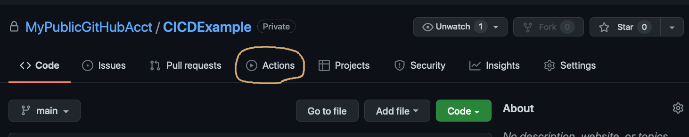

# Hello World!

This project makes a simple HelloWorld command line program that returns a life affirming message. Github Actions are used to build and test the project each time changes are made to files. The Catch2 testing framework is used to provide automated testing ability.

## CI / CD Overview

CI/CD can confuse people. When it is talked about, CI is always intended to refer to *Continuous Integration*. Confusingly CD can mean either *Continuous Delivery* or *Continuous Deployment*, but it often means both. More confusingly, CD is sometimes thought of as part of CI.

* **Continuous Integration** is a process performed to ensure that code is regularly built, tested, and that changes are merged to a shared repository.

* **Continuous Delivery** is a process performed to ensure that code is tested when changes are made. Typically, this automation is triggered when code is checked into a development branch.

* **Continuous Deployment** is a process performed to automatically deploy changes to a production environment.

## But first, let's make it work *locally*

In general practice it is not always necessary to automate these steps locally before using Github Actions. It is done here to show what some steps may look like if done locally first. In this example, we will see **Continuous Integration** and **Continuous Delivery** only.

The local version of this system uses Python 3.x scripts to perform the steps cross-platform. If you look closely you will see that, for the most part, the Python scripts are sending native shell commands to each OS for building and testing. In Github Actions, a [yaml](https://yaml.org) configuration file will be used to define the steps for building, testing, and deploying (to Github).

### 1. Local: Run CMake to build the project files

To build the project files, use the command ```python3 scripts/cmake.py``` for debug or ```python3 scripts/cmake.py r``` for release.  _Note_: Nija needs to be installed on Linux and Windows.

### 2. Local: Build the HelloWorld and HelloWorld_tests applications

To build the application files, use the command ```python3 scripts/build.py d``` for debug or ```python3 scripts/build.py r``` for release.

### 3. Local: Run the tests

To test the application, use the command ```python3 scripts/tests.py```.

The first time, there is a test comparing the square root of 7 to 40. This, of course, is wrong. Someone doing [Test Driven Development](https://en.wikipedia.org/wiki/Test-driven_development) (a.k.a. TDD) may do this intentionally at first to make sure the function meets the author's design with values that both match an expected input type and those that do not. A variation on this is also often done in secure coding practices to give the developer confidence that a function will not provide a bad guy with something they could use in ways undesired by the application's owner.


Once the expectation in the TEST_CASE has been updated to be the correct expectation, the test passes.


When the applicaiton is run, you get a life affirming message. How nice.


### 4. Local: Clean the local environment

To remove the built files and the other files used to build them, use the command ```python3 scripts/clean.py```.

## Now let's make it work *in the cloud* with Github Actions

The steps we did locally above are all configured to be done by Github actions in a yaml file. It is a markup language, no matter what the yaml authors would have you believe.

You can find this file [here](https://github.com/MyPublicGitHubAcct/CICDExample/blob/main/.github/workflows/main.yml), but there are a few things which may be good to know before reading it. 

First, it runs when tags are updated (e.g., from v1.0.0 to v1.0.1) in the repository (**CICDExample** in this case). Some people will refer to a repository as 'repo' because they think respository is too hard to say for some reason. Below is configuration that causes *releases* to be deployed when the version tag is updated.

```
on:
  push:
    tags:
      - "*"
```

Another thing to know is that Github Actions can be used to build on the three most common (consumer) platforms: Linux, macOS, and Windows. In the ```jobs``` section of the markup you will see the matrix. Really you will, and it defines which versions of each OS to build on. Nobody can be told what the matrix is, you have to see it for yourself. 

```
name: ${{ matrix.config.name }}
complex-workflows#using-a-build-matrix
runs-on: ${{ matrix.os.runner }}

strategy:
  fail-fast: false
  matrix:
    os:
      - runner: macos-latest
        name: mac
      - runner: windows-latest
        name: windows
      - runner: ubuntu-latest
        name: ubuntu

```

Not all companies build their products for cross-platform use, but then the world is sometimes not as good as it should be.

Anyway, there is a ```steps``` section that runs the commands to build the application and run the tests, listed below.  Each of these has a name, a command that is run, and an option to choose the shell that the command is run in.

* *CPrint runner.os, etc.*
* *Create Build Environment*
* *Configure CMake*
* *Build*
* *Test*
* *Prepare Artefacts <for some platform>*
* *Archive Artifacts <for some platform>*
* *Release Artifacts <for all platforms>*

In this case, we aren't deploying (a.k.a. copying) the application files to a server to be run. That could be done, of course, but it would cost money and Github lets us create releases which are downloadable for free so that is the option chosen here.

By the way, cleaning up the environment is taken care of by Github, so there is no configuration we are responsible for.

### What does it look like when changes are made?

Since we are not doing this together, let's look at the feedback Github Actions provided when the code was uploaded to Github.

But, before we do, we need to tag the code (i.e., give it a version number). As mentioned earlier, this will be used by the Github Action to determine if it needs to run the workflow.

A Git command is used to tag the code. The tag is just a string, so it could be something like **v1.0.0**. Tags are *not* pushed the same way that code is, so it is necessary to explicitly push them.

When updating the version of code, the following commands can be used in this order.

```
git add --all
git commit -m "<text>"
git push origin
```

The following commands can be used to initiate a release of the code that is already checked in. Remember, the yaml file defines when to run the commands it contains as anytime the tag is updated, so using the commands below will trigger the process to begin.

```
git tag <tagname>
git push origin --tags
```

In Github, things are much slower than doing the same things locally. It is free so it is probably wrong to complain too much. The upside of slowness is that we can see the process as it happens.

Here is the job running - 


Similar to how things happened in the local environment, the first time the code was checked into the repo in Github, the test comparing the square root of 7 to 40 failed.


After the erroneous test was fixed, the tests completed successfully.


Github shows nice green and red icons to describe what went well and what did not. You can also see your history of success and failure.


If you want to see the workflows and details about what happened during them, click on **Actions**.



## Interesting, maybe not obvious

If you read the workflow (yaml) file, you will see crazy looking things like ```${{ github.workspace }}```. These are convenient constants that Github Actions make available that relate to configuration that was set or to paths on the operation system that are useful when writing shell scripts. See ```main.yml```.

```
runner.os        == Linux
runner.workspace == /home/runner/work/CICDExample
matrix.os.runner == ubuntu-latest
github.workspace == /home/runner/work/CICDExample/CICDExample

runner.os        == macOS
runner.workspace == /Users/runner/work/CICDExample
matrix.os.runner == macos-latest
github.workspace == /Users/runner/work/CICDExample/CICDExample

runner.os        == Windows
runner.workspace == D:\a\CICDExample
matrix.os.runner == windows-latest
github.workspace == D:\a\CICDExample\CICDExample
```

*Darwin* - In comments you will see this mentioned in addition to Windows and Linux. *Darwin* is an Open Source (OSS) Unix-like Operating System based on [XNU](https://en.wikipedia.org/wiki/XNU), [FreeBSD](https://www.freebsd.org) and several other Open Source projects that Apple bases [macOS](https://en.wikipedia.org/wiki/MacOS) upon. 

The [Linux kernel](https://github.com/torvalds/linux) is OSS as are most if not all other parts of common Linux distributions.

The Windows Operating System is Closed Source.

## Useful Guides
* CMake is well described in this [video](https://youtu.be/YbgH7yat-Jo).
* Github [blog post](https://github.blog/2022-02-02-build-ci-cd-pipeline-github-actions-four-steps/)
* Github Actions [video](https://youtu.be/0yJbHewtHqg)
